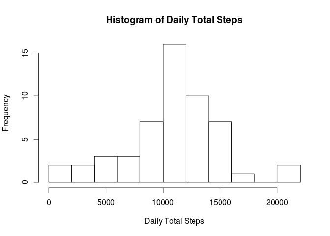
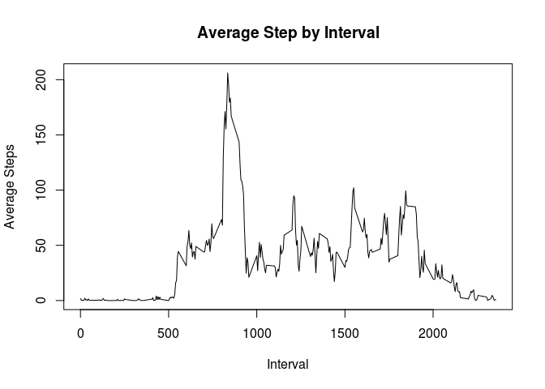
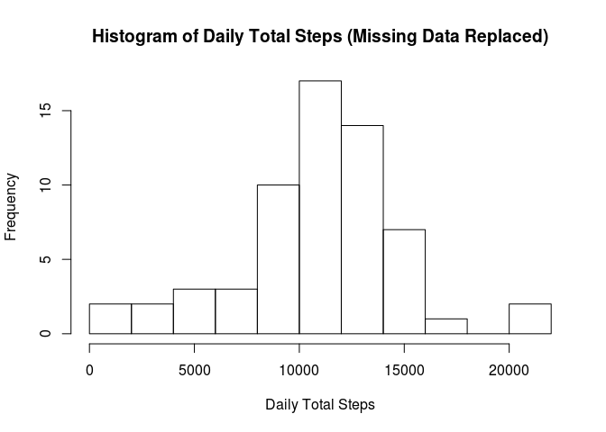
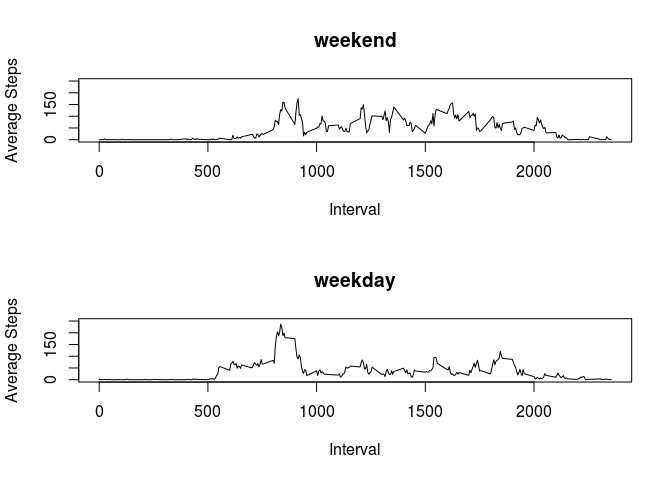

# Reproducible Research: Peer Assessment 1
Matthew Tanner  
mjtanner@uga.edu


## Loading and preprocessing the data

Loading the data requires the fully qualified path and file name or for the data file to reside in the current working directoru:


```r
setwd("~/RepData_PeerAssessment1")
activityData <- read.table(unz("activity.zip", "activity.csv"), header=T, sep=",")
str(activityData)
```

```
## 'data.frame':	17568 obs. of  3 variables:
##  $ steps   : int  NA NA NA NA NA NA NA NA NA NA ...
##  $ date    : Factor w/ 61 levels "2012-10-01","2012-10-02",..: 1 1 1 1 1 1 1 1 1 1 ...
##  $ interval: int  0 5 10 15 20 25 30 35 40 45 ...
```


## What is the mean total number of steps taken per day?

Here we call the dplyr package to call the 'sum' funciotn on all the levels of 'date'.


```r
library(dplyr)
totalStepsByDate <- group_by(activityData, date) %>% summarize(total_steps = sum(steps))
hist(totalStepsByDate$total_steps, main = "Histogram of Daily Total Steps", xlab = "Daily Total Steps", breaks = 10)
```

 


## What is the average daily activity pattern.

Here we again call on the dplyr package to calculate the means steps for all levels of interval and output the results to a histogram.


```r
averageStepsPerInterval <- group_by(activityData, interval) %>% summarize(average_steps = mean(steps, na.rm = TRUE))
plot(averageStepsPerInterval$interval,averageStepsPerInterval$average_steps, main = "Average Step by Interval", xlab = "Interval", ylab = "Average Steps", type = "l")
```

 

The following code segment returns the 5-minute interval with the maximun average number of steps


```r
averageStepsPerInterval$interval[which.max(averageStepsPerInterval$average_steps)]
```

```
## [1] 835
```


## Imputing missing data

Here we calculate the total number of missing data:


```r
sum(is.na(activityData$steps))
```

```
## [1] 2304
```

Our strategy is to replace missing data with the weekday average with respect to 5-minute interval.


```r
# New copy of the data.
newActivityData <- activityData

# Introduce the weekday variable.
newActivityData$day <- weekdays(as.Date(newActivityData$date))

# Call dplyr to calculate the mean for all levels of weekday.
averageStepsPerWeekdayInterval <- group_by(newActivityData, interval, day) %>% summarize(average_steps = mean(steps, na.rm = TRUE))

# Strobe all the data records with missing data and replace the missing data with the weekday averate. 
for (i in 1:nrow(newActivityData)) {
  if(is.na(newActivityData[i,,]$steps)) {
    newActivityData[i,]$steps <- as.integer(round(averageStepsPerWeekdayInterval[which(averageStepsPerWeekdayInterval$day == newActivityData[i,]$day & averageStepsPerWeekdayInterval$interval == newActivityData[i,]$interval),]$average_steps))
  }
}
```

We again call on the dplyr functionality to calculate and displace the total number of steps per date. The histogram profile appears unchanged. Conceptually, ignoring missing data might, in many cases, be equivalent to replaced them with values derived from flat averages. 


```r
totalStepsByDate <- group_by(newActivityData, date) %>% summarize(total_steps = sum(steps))

hist(totalStepsByDate$total_steps, main = "Histogram of Daily Total Steps (Missing Data Replaced)", xlab = "Daily Total Steps", breaks = 10)
```

 

The daily mean and median steps are:


```r
meanSteps = mean(totalStepsByDate$total_steps)
medianSteps = median(totalStepsByDate$total_steps)
```


##Are there differences iun activity patterns between weekdays and weekdays

We first introduce the new variable "daytype".


```r
dayType <- ifelse((newActivityData$day == "Saturday" | newActivityData$day == "Sunday"), "weekend", "weekday")

newActivityData$dayType <- as.factor(dayType)
```

We then calculate the mean steps for levels of dayType over the 5-minute intervals.


```r
averageStepsPerDayTypeInterval <- group_by(newActivityData, interval, dayType) %>% summarize(average_steps = mean(steps))
```

Finally, we plot the respective line plots in the prescribed format.

```r
xWeekday <- averageStepsPerdayTypeInterval$interval[which(averageStepsPerdayTypeInterval$dayType == "weekday")]
xWeekend <- averageStepsPerdayTypeInterval$interval[which(averageStepsPerdayTypeInterval$dayType == "weekend")]
yWeekday <- averageStepsPerdayTypeInterval$average_steps[which(averageStepsPerdayTypeInterval$dayType == "weekday")]
yWeekend <- averageStepsPerdayTypeInterval$average_steps[which(averageStepsPerdayTypeInterval$dayType == "weekend")]

par(mfrow=c(2,1))
plot(xWeekend,yWeekend, main = "weekend", type = "l", ylab = "Average Steps", xlab = "Interval", ylim = c(0,250))
plot(xWeekday,yWeekday, main = "weekday", type = "l", ylab = "Average Steps", xlab = "Interval", ylim = c(0,250))
```

 

Significant differences between the weekday and weekend profile are apparent.  The weekday profile has a significantly higher peek corresponding to the early morning hours, while the weekend profile appears to have greater variablity over time and generally higher values after the early morning.
